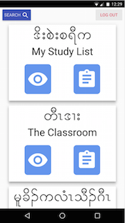
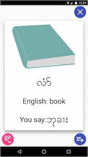
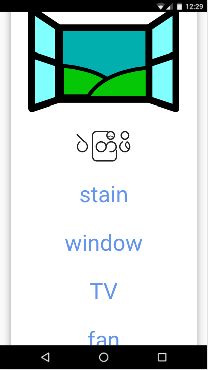
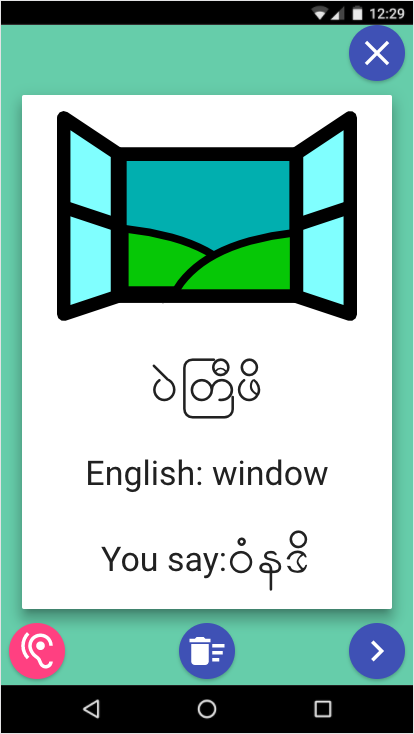

# Karen-English Picture Dictionary
Y Paul Sussman, May 04th 2017
Version 1.0

----

## Application Overview
This mobile-first web application allows Karen-speaking English learners to search or browse by theme, explore both an entry’s definition and pronunciation (approximated into the Karen script), and listen to a native speaker pronounce the word aloud.

It also includes a flashcard service for students to practice both whole-word recognition and phonic decoding, and a study list for students to save words they'd like to review later.

A desktop view allows admin to add, edit, and remove dictionary entries.

   

## Getting Started

---

Fork, clone, or download the project, then run `npm install`.

## Built With

---

* HTML 5, CSS 3, and AngularJS Material;
* AngularJS, AngularJS Routes, and SpeechSynthesis (Web Speech API);
* Node.js, Express.js, Passport, PG, PostgreSQL, and S3 (AWS).
